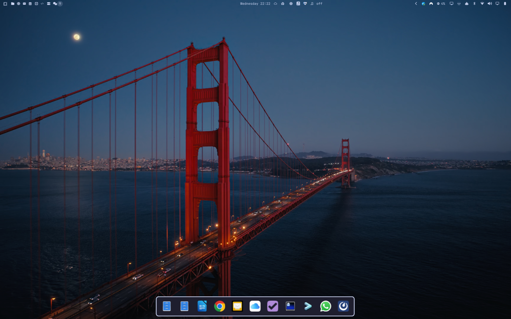

# App Dock



A macOS-Dock-style strip along the bottom of the screen: one icon per open
window, ordered by workspace 1-9 (then creation order within each). Click an
icon to jump straight to that window — focuses it and switches you to its
workspace.

**Rest your cursor at the very bottom screen edge** to reveal it, move the
cursor away to hide it again — this is a cursor-position trigger, not a
gesture. Sibling project to
[Workspace Ribbon](https://github.com/crazybadger/omarchy-workspace-ribbon)
(swipe up for a Mission-Control-style workspace strip) — same icon-resolution
approach, same "generic overlay" plugin contract, different trigger and a
different job: Ribbon is about *workspaces*, Dock is about *windows*.

Deliberately not a persistent pinned bar — that would fight Hyprland's tiling
philosophy (no window list to manage, no "pin an app" concept). It's a
transient reveal of whatever's actually open right now, gone again the
moment you move on.

## Install

```bash
omarchy plugin add https://github.com/crazybadger/omarchy-app-dock.git
omarchy plugin enable crazybadger.app-dock
```

That installs and enables it, but nothing triggers it yet — add the
cursor-edge trigger from **Trigger it** below, then `omarchy restart shell`.

## Trigger it

Unlike a gesture-bound plugin, this is driven by a small cursor-position
poller in `~/.config/hypr/input.lua` — there's no single dispatcher call to
bind to a key, since "reveal when the cursor rests at the bottom edge" isn't
a stock Hyprland gesture. Add this block (or see the full version with
comments in this repo's `input.lua.snippet`):

```lua
do
  local dockOpen = false
  local dockEdgeMs = 0
  local dockLeaveMs = 0
  local pollMs = 100
  local openDwellMs = 350
  local closeDwellMs = 250
  local triggerZonePx = 4
  local stayOpenZonePx = 170

  local function setDock(open)
    hl.dispatch(hl.dsp.exec_cmd("omarchy-shell shell " .. (open and "toggle" or "hide") .. " crazybadger.app-dock"))
  end

  hl.timer(function()
    local pos = hl.get_cursor_pos()
    local mon = hl.get_monitor_at_cursor()
    if pos and mon then
      local logicalBottom = mon.y + mon.height / (mon.scale or 1)
      local fromBottom = logicalBottom - pos.y

      if not dockOpen then
        if fromBottom <= triggerZonePx then
          dockEdgeMs = dockEdgeMs + pollMs
          if dockEdgeMs >= openDwellMs then
            dockOpen = true
            dockEdgeMs = 0
            setDock(true)
          end
        else
          dockEdgeMs = 0
        end
      else
        if fromBottom <= stayOpenZonePx then
          dockLeaveMs = 0
        else
          dockLeaveMs = dockLeaveMs + pollMs
          if dockLeaveMs >= closeDwellMs then
            dockOpen = false
            dockLeaveMs = 0
            setDock(false)
          end
        end
      end
    end
  end, { timeout = pollMs, type = "repeat" })
end
```

Two zones, not one, and that's deliberate: a slim edge strip (`triggerZonePx`)
to trigger *opening*, dwell-gated (`openDwellMs`) so dragging a window to the
bottom edge or resizing doesn't false-trigger it — and a much taller
"stay open" zone (`stayOpenZonePx`) once it's open, so moving the cursor up
into the dock's own icons to click one doesn't immediately hide it again.

Or drive it directly, from anywhere:

```bash
omarchy-shell shell toggle crazybadger.app-dock
omarchy-shell shell summon crazybadger.app-dock   # open only
omarchy-shell shell hide crazybadger.app-dock     # close only
```

## Using it

- Click an icon to focus that window (dismisses the dock).
- Clicking outside the bar dismisses without switching.
- A small dot under an icon marks the currently-focused window.
- No keyboard focus is grabbed while open — it's triggered passively by
  cursor position, so stealing focus (e.g. mid-sentence in another app)
  would be actively disruptive. Mouse-only, deliberately.

## How it's built

- `kinds: ["overlay"]` — a transparent `PanelWindow`
  (`WlrLayershell.layer: Overlay`, **no** keyboard focus grab, unlike most
  overlays), same family as Workspace Ribbon and the built-in emoji/clipboard
  pickers, just anchored to the bottom instead of centered near the top.
- Window data comes from `Quickshell.Hyprland` (`Hyprland.workspaces[].
  toplevels`), flattened across workspaces 1-9 (plus any higher-numbered ones
  in use) into one ordered list. Icon resolution is the exact same three-tier
  fallback as Workspace Ribbon (XDG icon index → themed lookup →
  `.desktop`-title matching for webapps) — see that repo's README for the
  full writeup, not re-explained here since nothing about it changed.
- **Focusing a specific window, not a workspace:** `hl.dsp.focus({ window =
  "address:0x..." })` (vs. Ribbon's `hl.dsp.focus({ workspace = "<id>" })`) —
  focuses that exact window and auto-switches to its workspace. One sharp
  edge worth documenting: Quickshell's Hyprland binding returns a toplevel's
  `.address` **without** the `0x` prefix Hyprland's own window-selector
  syntax requires. Missing that prefix doesn't error — the dispatcher just
  silently matches nothing. Prepend `0x` before building the command.
- **Cursor-position units mismatch:** `hl.get_cursor_pos()`,
  `hl.dsp.cursor.move({x,y})` and the monitor's `x`/`y` are all *logical*
  layout pixels, but `hl.get_monitor_at_cursor()`'s `width`/`height` are
  *physical* (plus a `.scale` field). Only the **height** is divided by the
  scale: the bottom edge is `y + height / scale`, **not** `(y + height) / scale`.
  The two agree while the monitor sits at `y = 0`, so the wrong version looks
  fine on a single screen — then puts the trigger far above the real edge as
  soon as the monitor is offset in the layout (e.g. a saved multi-monitor
  arrangement).
- `keepLoaded: true`, same as Ribbon — instantiated once at shell start.
  **Note for future edits:** live-editing this QML while the shell is
  already running doesn't reliably refresh an already-open instance — run
  `omarchy restart shell` after changes, don't rely on hot-reload alone.

## Uninstall

```bash
omarchy plugin disable crazybadger.app-dock
rm -rf ~/.config/omarchy/plugins/crazybadger.app-dock
```
Then remove the cursor-trigger block (marked `ROLLBACK:` in a comment) from
`~/.config/hypr/input.lua`.

## Credits

Built by [Claude](https://claude.com/claude-code) (Anthropic) — the idea,
testing and this repo's owner are [crazybadger](https://github.com/crazybadger)'s,
but every line of QML, the reverse-engineering of the `hl` Lua dispatch API,
and this README were written by Claude Code in conversation with them.
Seemed worth saying plainly rather than taking the credit.
